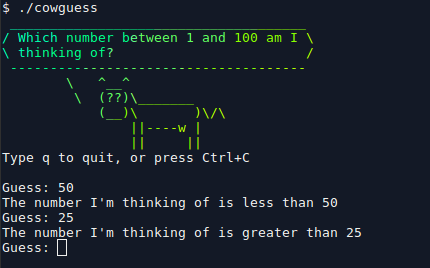

# cowguess
Simple guessing game written in bash



## Description
Guess what number the cow is thinking of.

## Dependencies
I recommend that you install __cowsay__ and __lolcat__

On Ubuntu and Linux Mint
```sh
sudo apt install cowsay lolcat
```
